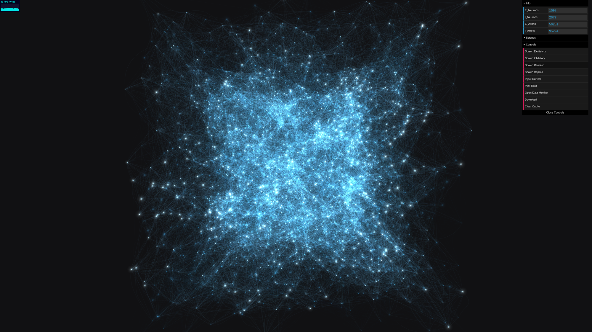

# Neuroscope

Neuroscope is a three.js based 3D network simulation inspired by and built on top of [Neural-Network](https://github.com/nxxcxx/Neural-Network). It provides a 3D animated simulation of network dynamics by Integrate-and-Fire model with simple Hebbian plasticity. Also can be viewed from HTC vive with WebVR 

